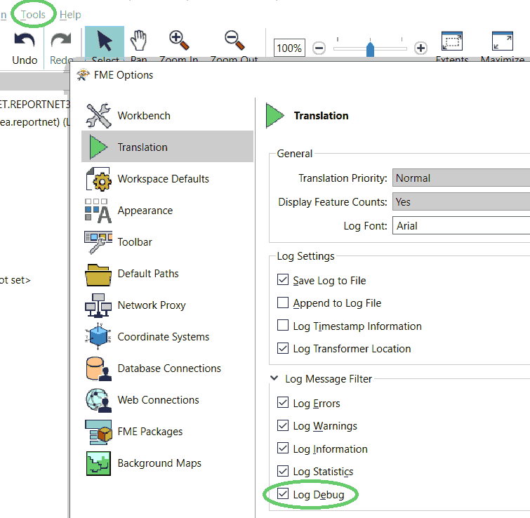
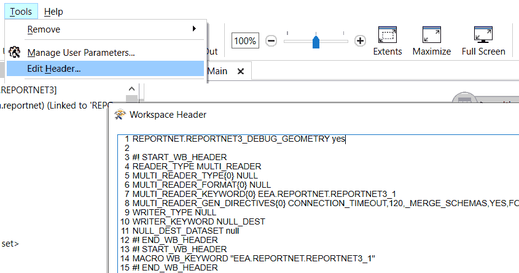

# Debugging
The Reader/Writer has the ability to produce different kinds of debug information.

Please be aware that the debugging settings will cause *a lot* of extra I/O. In most cases, this is *__not preferred in a production environment__*.

## FME Log Message Filter
In FME Workbench, go to "Tools/FME Options.../Translation/Log Message Filter" and check/uncheck the option "Log Debug":
   

## Reader/Writer Directives
There are no normal GUI parameters for these settings. Instead they can be edited using the "Workspace Header".

In FME Workbench, Go to "Tools/Edit Header..." and enter the directives:



### `EEA.REPORTNET.REPORTNET3_DEBUG_GEOMETRY`
**Boolean** (yes/no) - When set to `yes`, this will cause the writer to output the GEOJSON encoded geometry of each FME Feature to the FME Log File. Note that "Log Deug" also has to be enabled (see above).

Example:

```
EEA.REPORTNET.REPORTNET3_DEBUG_GEOMETRY yes
```

### `EEA.REPORTNET.REPORTNET3_DEBUG_HTTP_POST`
_*WARNING*_ - _This directive will write the entire HTTP-Post Body to files in clear text. When working with sensitive data, that may not be a good idea._

**Existing Folder** - When set to an _existing_ folder, this will cause the writer to dump each HTTP Post Body to a file in that folder.

Example:

```
EEA.REPORTNET.REPORTNET3_DEBUG_HTTP_POST C:\temp\rn3debug
```

The filename(s) holds some information and is composed like this:

```
<timestamp>_<duration>_<batch_nbr>_<url>_<param=value[&param=value]*>_<http_status>.json
```

Example:

```
20221201_170215_3.85_1_https__test-api.reportnet.europa.eu_dataset_v1_8974_etlImport_dataflowId=1039_200.json
```

Characters that are not allowed in a filename (`'\/:*?"<>'`) will be replaced by underscore (`'_'`) or empty string (`''`).